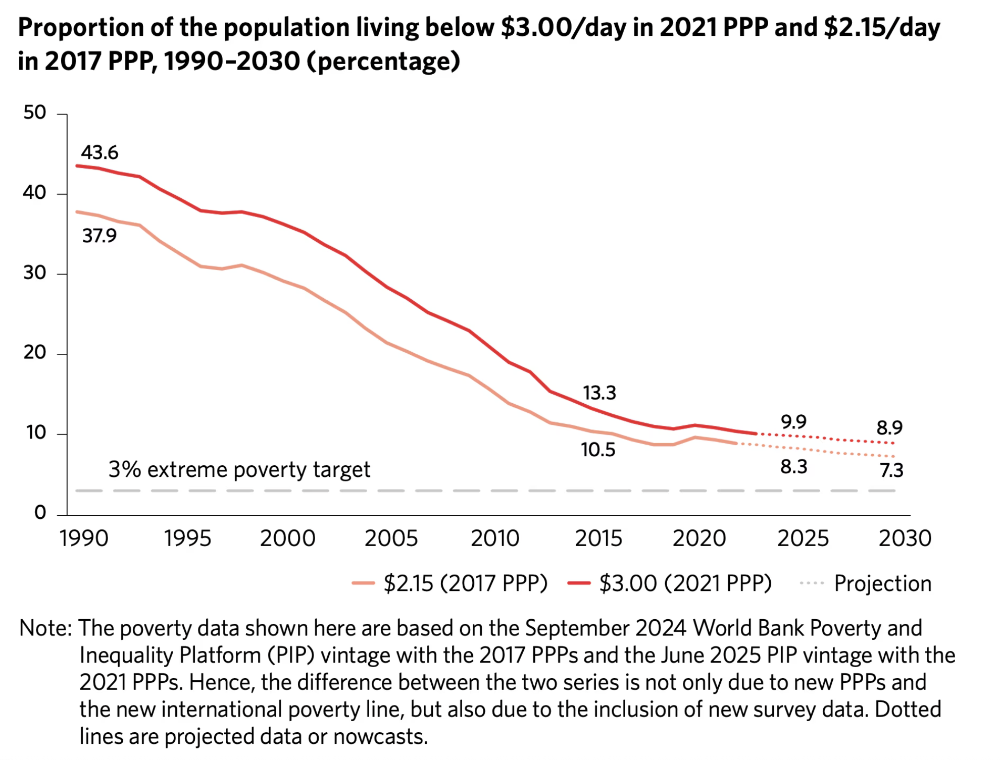

# Chosen One

**What SDG/SDGs am I researching on? A brief overview on them.**

## SDG 1: No Poverty

SDG 1 is the foundational goal. Its ambition is extremely simple: end poverty in all its forms, everywhere, by 2030. Its seven targets address extreme poverty (living below $3 per day in 2025), national poverty reduction, social protection systems, equal rights to economic resources, climate and disaster resilience, and international resource mobilization (UN 2025a).

This goal does not define poverty as just income. It captures the full texture of deprivation: lack of land, lack of legal standing, lack of social protection, lack of resilience to shocks. Poverty in the SDG framework is multidimensional. And so are its solutions.

The UN frames ending extreme poverty as "the greatest global challenge and an indispensable requirement for sustainable development" (UN 2025a). You cannot build climate-resilient infrastructure when a billion people are too hungry to attend school. You cannot achieve gender equality when women lack basic economic rights. SDG 1 is not one goal among seventeen. It is the precondition for the other sixteen.

## SDG 8: Decent Work and Economic Growth

SDG 8 demands sustained, inclusive, and sustainable economic growth alongside full and productive employment and decent work for all. Its 12 targets range from per capita GDP growth (at least 7 percent annually in Least Developed Countries), to labor rights compliance, youth unemployment reduction, forced labor eradication, financial inclusion, and sustainable tourism.

The goal explicitly links economic productivity with social protection, recognizing that growth which leaves workers unprotected or underpaid is not development. It is extraction with GDP statistics attached.

SDG 8 and SDG 1 are two sides of the same coin. Working poverty, being employed but still earning below the poverty line, is the bridge between them. You can have low unemployment and still have mass poverty if wages are too low, if jobs are informal, or if workers lack legal protection. That is exactly the situation much of the world finds itself in today.
