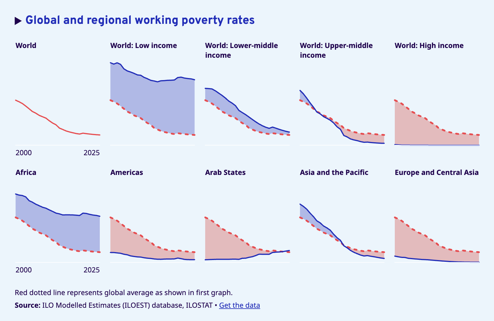
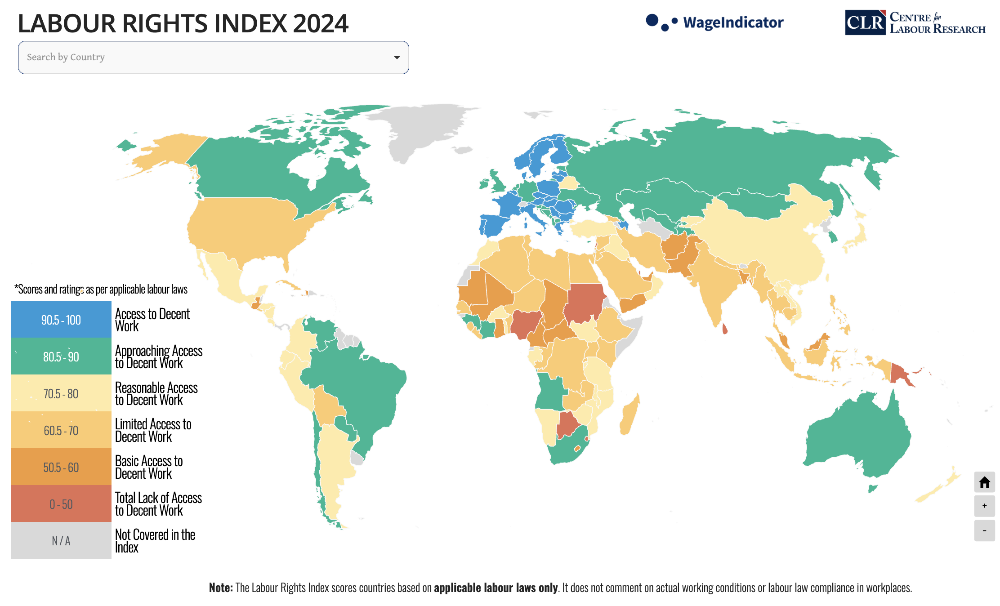

# Deepdive

**This is where we go deep inside our chosen ones i.e SDG 1 and SDG 8.**

## SDG 1 Deep Dive: The Full Picture of Poverty

Extreme poverty is defined by the World Bank's international poverty line, currently set at $3 per day in 2021 purchasing power parity terms. In 2025, 808 million people, or 1 in every 10 people worldwide, were living in extreme poverty under this updated line (UN 2025a).

When the SDGs were adopted in 2015, approximately 800 million people lived in extreme poverty at 10.8 percent of the global population. Progress was being made. Then COVID-19 arrived. The pandemic reversed three decades of steady progress, with the number of people in extreme poverty increasing for the first time in a generation. By 2022, 712 million people still lived in extreme poverty, 23 million more than in 2019, and recovery in low-income countries has remained painfully slow (World Bank 2024a).

The geography of poverty is not random. By 2025, more than three-quarters of the global extreme poor will live in sub-Saharan Africa or in fragile and conflict-affected countries (UN 2025a). Conflict accelerates poverty with devastating speed. Sudan's extreme poverty rate more than doubled during its civil war, rising from 23 percent in 2022 to 59 percent in 2024 (World Bank 2024a).

Working poverty is the invisible layer underneath these numbers. In 2024, 244 million workers globally still lived below the poverty line despite being employed (ILO 2025). Youth are twice as likely as adults to fall into this category. Being employed is not the same as escaping poverty when wages are too low, jobs are informal, and workers have no legal protection.

Social protection tells a similar story of progress that stops short. For the first time, more than half of the world's population holds at least one social protection benefit. But 3.8 billion people remain completely uncovered, and in low-income countries, coverage sits at just 9.7 percent, barely changed since 2015 (UN 2025a).

None of the SDG 1 targets are on track. If current trends persist, 8.9 percent of the world's population will still live in extreme poverty by 2030 (UN DESA 2025).

## SDG 8 Deep Dive: The full picture of Economic Growth

Global real GDP per capita rebounded after a 3.8 percent drop in 2020 caused by COVID-19, peaking at 5.5 percent growth in 2021. But it has slowed steadily since, settling at 1.9 percent in 2023 and projected at just 1.5 percent for 2025 (UN 2025b). The 7 percent annual GDP growth target for Least Developed Countries, one of SDG 8's central benchmarks, remains badly off track. LDCs managed only 3.1 percent in 2024. Less than half the target.

The headline unemployment figure is misleading. The global unemployment rate fell to a record low of 5.0 percent in 2024, which sounds like good news. But nearly 58 percent of workers remained informally employed (UN 2025b). Informal workers lack contracts, benefits, and social insurance. They are statistically employed but substantively unprotected. Reducing unemployment without reducing informality does not move the needle on decent work.

Labor rights are quietly eroding. From 2015 to 2023, the global average level of national compliance with labor rights declined by 7 percent (UN 2025b). This is not a passive trend. It reflects deliberate policy choices, weakened unions, suppressed collective bargaining, and underfunded enforcement. Growth without labor rights is not decent work.

Women's participation in the labor force has improved, edging up from 62.8 percent to 64.5 percent among prime-aged women since 2015. But 379 million prime-aged women outside the workforce cited caregiving as their primary barrier in 2023 (UN Women 2025). And generative AI is adding new pressure, with 27.6 percent of women's jobs exposed to automation compared to 21.1 percent of men's.

Behind all of this is a financing crisis. In 2024, developing countries paid over $400 billion in debt servicing, contributing to an estimated $982 billion fiscal gap for labor market recovery (IISD 2025). Governments cannot build decent work systems while sending that much money out the door.
